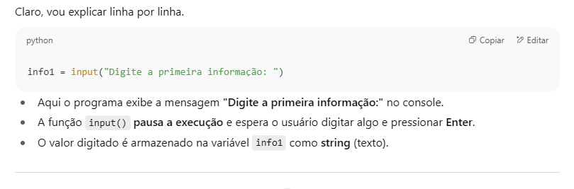
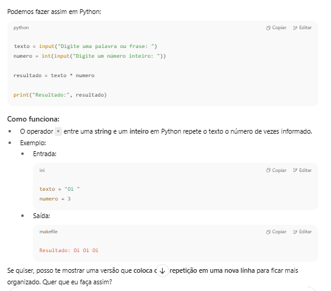
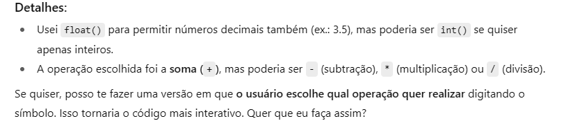
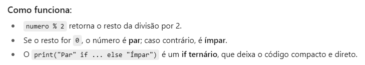

# Resolvendo Codigos em Python com o ChatGPT

Olá!! Aqui veremos iremos resolver alguns codigos em Python com a ajuda do ChatGPT, sob orientação da Professora Aline da DIO!

O desenvolvimento foi realizado no GitHub Codespace.

**Você pode encontrar minhas resoluções dos exercicios na pasta giovana_resolucoes_code.**

## Primeiro codigo: Concatenando Dados

**Descrição:** Vamos receber dois dados diferentes do usuário e concatena-los em uma única string?!

**Resolução**
1. Foram adicionados 2 inputs (info1 e info2).
2. Foi solicitado ao ChatGPT para concatenar os valores dos dois inputs.
3. O ChatGPT respondeu: resultado = info1 + info2.
4. Foi solicitado ao ChatGPT para descrever o algoritmo.
5. Descrição dada pelo ChatGPT:

## Segundo Codigo: Repetindo Textos

**Descrição:** Agora vamos solicitar uma string e um número inteiro como entrada. Depois teremos que retornar a string repetida o número de vezes informado.

**Resolução**
1. Foi solicitado ao ChatGPT "Agora vamos solicitar uma string e um número inteiro como entrada". Ele respondeu e a resposta foi aceita e adicionada ao codigo.
2. Agora foi solicitado "agora retornar a string repetida o número de vezes informado" ao ChatGPT, e a resposta foi aceita e inserida ao codigo. Além disso, o ChatGPT também explicou a resolução.

3. Foi editado o codigo manualmente para realizar um espaço entre as strings.

## Terceiro codigo: Matemáticas Simples

**Descrição:** Vamos solicitar como entrada dois números e depois vamos realizar uma operação simples entre eles.

**Resolução**
1. Foi solicitado ao ChatGPT: "Vamos solicitar como entrada dois números e depois vamos realizar uma operação simples entre eles".
2. O ChatGPT respondeu com o codigo que foi aceito e adicionado ao terceiro_codigo.py.
3. Além do codigo, o ChatGPT explicou o algoritmo:

## Quarto codigo: Verificando Números Pares e Ímpares

**Descrição:** Como entrada, receba um número inteiro e verifique se ele é par ou ímpar. Uma dica é: Utilize condicionais para realizar a verificação e, se possível, faça uso do Github Copilot(ou outra IA) para otimizar a estrutura do código.

**Resolução**
1. Foi solicitado ao ChatGPT: "Como entrada, receba um número inteiro e verifique se ele é par ou ímpar. Uma dica é: Utilize condicionais para realizar a verificação e otimize o codigo".
2. O ChatGPT respondeu um codigo de 2 linhas que foi aceito e adicinado ao quarto_codigo.py.
3. O ChatGPT explicou brevemente o algoritmo:
